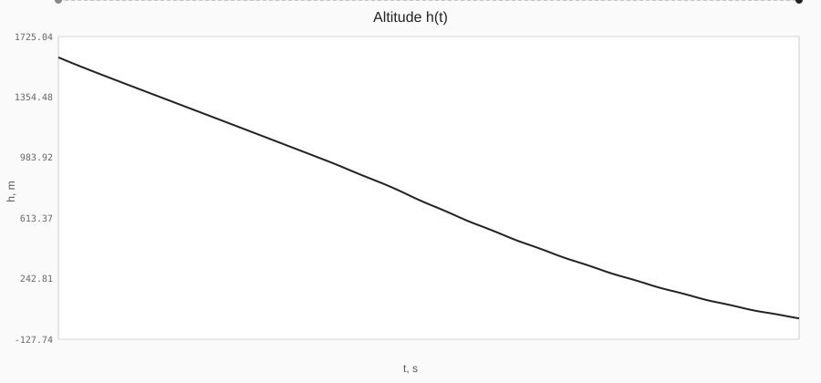
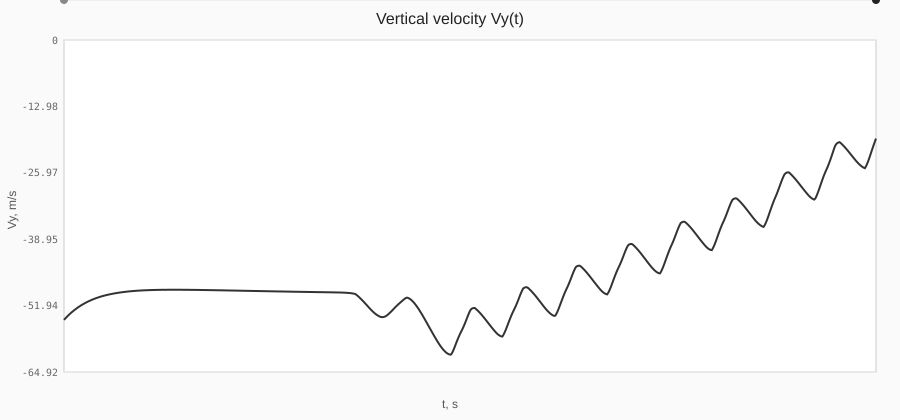
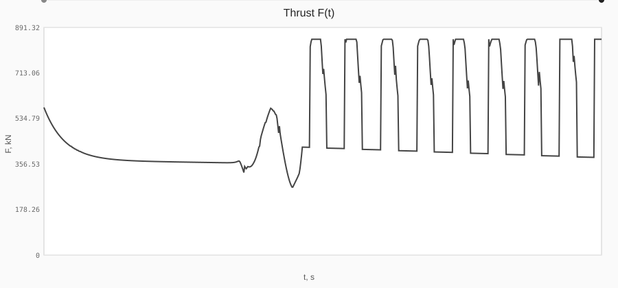
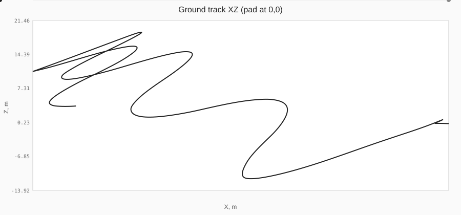
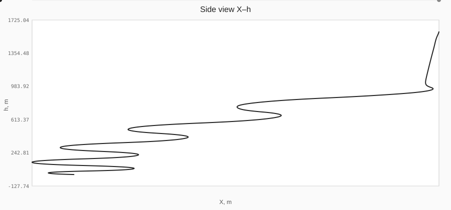

# Betelgeuse — Повний звіт посадки

**Тема роботи:** Розроблення інтелектуальної системи автономної посадки ракетоносія на основі нечіткої логіки та машинного навчання

**Дата:** 2026-08-07 23:56:33
**Алгоритм GNC:** Класичний PID
**Результат:** ❌ НЕВДАЛА ПОСАДКА
**Кроків логу:** 715

## 1. Критерії soft-landing і метрики

| Параметр | Значення | Норма | Статус |
|----------|----------|-------|--------|
| Швидкість приземлення |Vy| | 19,28 м/с | < 3,5 | ❌ |
| Нахил корпусу | 9,69° | < 7° | ❌ |
| Промах (pad) | 41,02 м | < 25 м | ❌ |
| Бічна швидкість |Vh| | 7,57 м/с | < 5 | ❌ |
| Залишок палива | 8197,6 кг | — | ✅ |
| Час польоту | 35,3 с | — | ✅ |
| Макс. висота | 1600 м | — | ✅ |
| SuccessScore | 16,3 / 100 | вище = краще | ✅ |

## 2. Файли пакета

| Файл | Зміст |
|------|--------|
| `01_step_calculations.csv` | Покрокові розрахунки (час, стан, тяга, T/W, gimbal) |
| `02_summary.json` | Машиночитаний підсумок |
| `03_altitude_vs_time.svg` | Графік висоти h(t) |
| `04_trajectory_XZ.svg` | Траєкторія на горизонтальній площині |
| `05_velocity_vs_time.svg` | Вертикальна швидкість Vy(t) |
| `06_thrust_vs_time.svg` | Тяга F(t) |
| `07_trajectory_side_XY.svg` | Бічний профіль X–h |
| `08_step_analysis.md` | Аналіз кроків і екстремумів |

**Каталог:** `SimulationLogs/Landing_Full_Класичний_PID_20260807_235633/`

## 3. Графіки (відкрийте SVG у браузері)











## 4. Пояснення результату

```
ПОСАДКА НЕВДАЛА

Причини:
• Швидкість 19,3 м/с  (треба < 3,5)
• Нахил 9,7°  (треба < 7°)
• Промах 41,0 м  (треба < 25 м)
• Бічна V 7,6 м/с  (треба < 5)

Оцінка: 16 / 100
```

## 5. Відповідність темі

| Аспект теми | Реалізація в Betelgeuse |
|-------------|-------------------------|
| Автономна посадка | RK4 + критерії soft-landing |
| Нечітка логіка | Fuzzy Sugeno-0 5×5 |
| Машинне навчання | MLP 5→8→2 + ES(1+λ) |
| Інтелектуальна гібридна система | Hybrid Neuro-Fuzzy |
| Дослідження / порівняння | Monte-Carlo + CSV/JSON/MD/SVG |

---
*Betelgeuse · магістерська кваліфікаційна робота, 2026*
