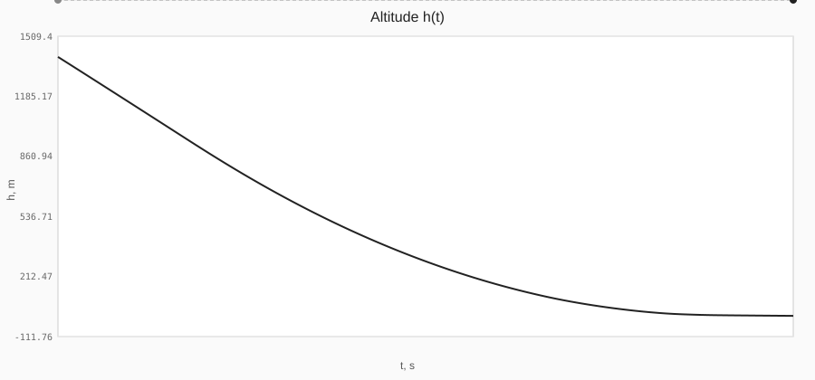
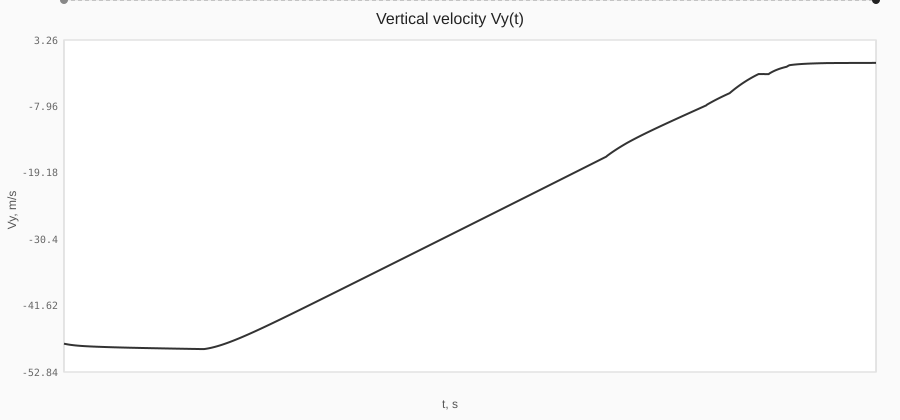
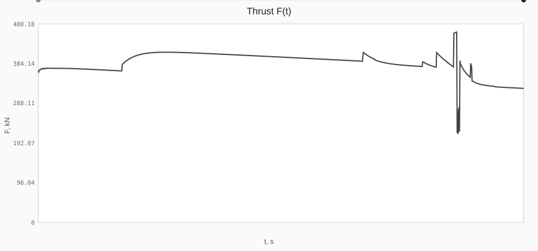
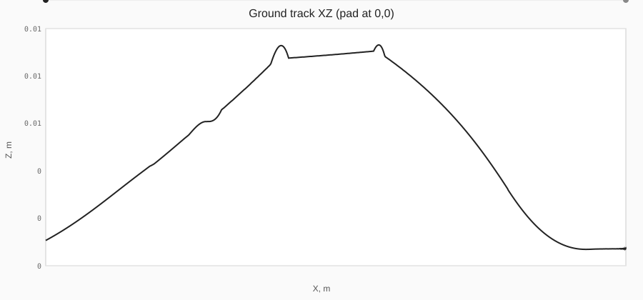
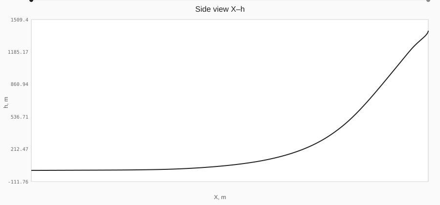

# Betelgeuse — Повний звіт посадки

**Тема роботи:** Розроблення інтелектуальної системи автономної посадки ракетоносія на основі нечіткої логіки та машинного навчання

**Дата:** 2026-08-08 00:10:58
**Алгоритм GNC:** Класичний PID
**Результат:** ✅ УСПІШНА ПОСАДКА
**Кроків логу:** 1324

## 1. Критерії soft-landing і метрики

| Параметр | Значення | Норма | Статус |
|----------|----------|-------|--------|
| Швидкість приземлення |Vy| | 0,60 м/с | < 3,5 | ✅ |
| Нахил корпусу | 0,00° | < 7° | ✅ |
| Промах (pad) | 9,11 м | < 25 м | ✅ |
| Бічна швидкість |Vh| | 0,36 м/с | < 5 | ✅ |
| Залишок палива | 7437,5 кг | — | ✅ |
| Час польоту | 52,1 с | — | ✅ |
| Макс. висота | 1400 м | — | ✅ |
| SuccessScore | 90,8 / 100 | вище = краще | ✅ |

## 2. Файли пакета

| Файл | Зміст |
|------|--------|
| `01_step_calculations.csv` | Покрокові розрахунки (час, стан, тяга, T/W, gimbal) |
| `02_summary.json` | Машиночитаний підсумок |
| `03_altitude_vs_time.svg` | Графік висоти h(t) |
| `04_trajectory_XZ.svg` | Траєкторія на горизонтальній площині |
| `05_velocity_vs_time.svg` | Вертикальна швидкість Vy(t) |
| `06_thrust_vs_time.svg` | Тяга F(t) |
| `07_trajectory_side_XY.svg` | Бічний профіль X–h |
| `08_step_analysis.md` | Аналіз кроків і екстремумів |

**Каталог:** `SimulationLogs/Landing_Full_Класичний_PID_20260808_001058/`

## 3. Графіки (відкрийте SVG у браузері)











## 4. Пояснення результату

```
ПОСАДКУ ВИКОНАНО УСПІШНО

• Швидкість: 0,6 м/с  (норма < 3,5)
• Нахил: 0,0°  (норма < 7°)
• Промах: 9,1 м  (норма < 25 м)
• Бічна V: 0,4 м/с  (норма < 5)
• Оцінка: 91 / 100
```

## 5. Відповідність темі

| Аспект теми | Реалізація в Betelgeuse |
|-------------|-------------------------|
| Автономна посадка | RK4 + критерії soft-landing |
| Нечітка логіка | Fuzzy Sugeno-0 5×5 |
| Машинне навчання | MLP 5→8→2 + ES(1+λ) |
| Інтелектуальна гібридна система | Hybrid Neuro-Fuzzy |
| Дослідження / порівняння | Monte-Carlo + CSV/JSON/MD/SVG |

---
*Betelgeuse · магістерська кваліфікаційна робота, 2026*
